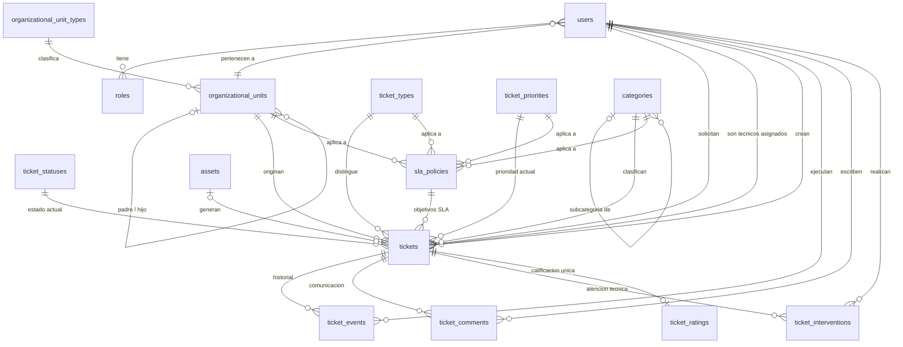
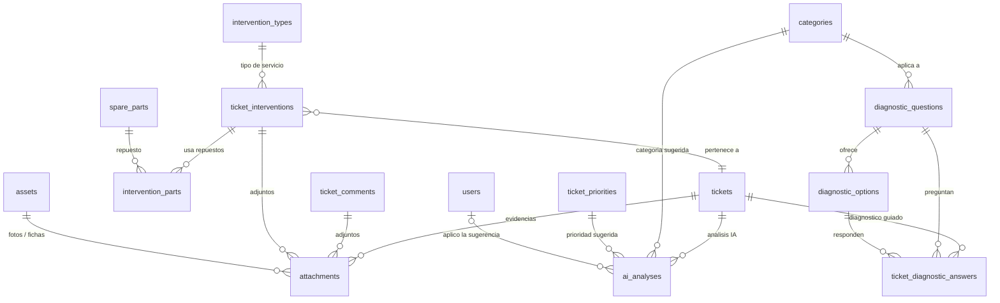
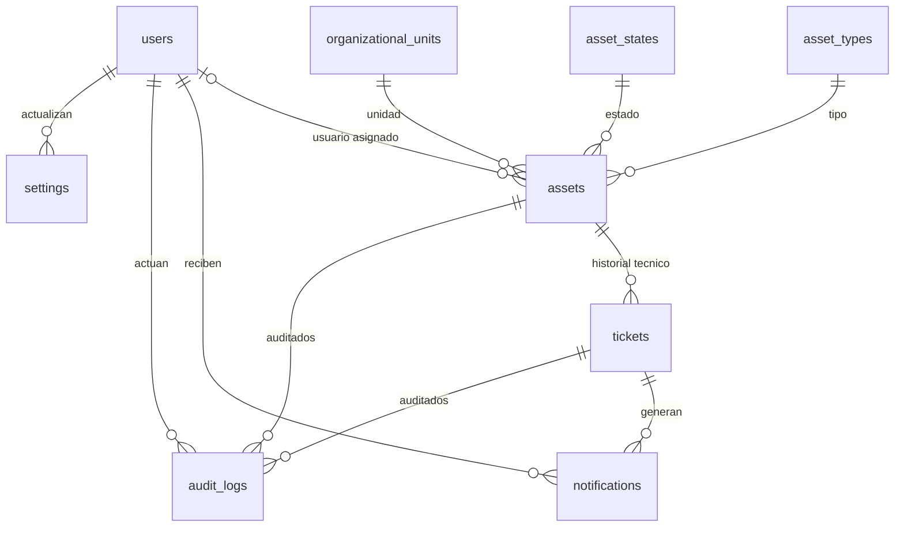

# DISEÑO DE BASE DE DATOS — V1.1
## Sistema Inteligente de Soporte Técnico · Cámara de Senadores de Bolivia
### Fase 1: Diseño (sin migraciones, modelos, API ni frontend)

**Motor:** MySQL 8.x / MariaDB 10.4+ · **Engine:** InnoDB · **Charset:** `utf8mb4` / collation `utf8mb4_unicode_ci`
**Framework objetivo:** Laravel (migrations + Eloquent) · **Fechas:** `TIMESTAMP` en **UTC** (presentación `America/La_Paz`)
**Estado:** V1.1 — diseño revisado con decisiones funcionales aprobadas. **Pendiente de aprobación explícita para Fase 2 (migraciones).**

---

## 0. Control de versiones

### 0.1 Cambios V1.0 → V1.1

| # | Área | Cambio aplicado |
|---|---|---|
| 1 | Índices polimórficos | `attachments`, `ai_analyses`, `audit_logs`, `notifications`: los índices `(tipo, id)` pasan de `UNIQUE` a **`INDEX` compuesto normal**. Ninguna entidad puede quedar limitada a un solo registro por un índice único erróneo |
| 2 | Historial de categoría | `ticket_events` incorpora `from_category_id` y `to_category_id` (FK → `categories`): categoría anterior, categoría nueva, usuario y fecha |
| 3 | Auditoría de IA | `ai_analyses` incorpora `applied_by_id` y `applied_at`: quién aplicó la recomendación y cuándo |
| 4 | Integridad categoría/subcategoría | Regla `subcategory.parent_id = category_id` garantizada en **4 capas**: validación API, `CHECK`, **FK compuesta** sobre `categories(id, parent_id)` y trigger opcional |
| 5 | Calificación | Solo disponible en estado **CERRADO**, escala 1–5, `UNIQUE(ticket_id)` |
| 6 | Archivos | Almacenamiento **local privado** (`disk = local`), 10 MB por archivo, solo metadatos en BD, preparado para storage externo sin cambio de esquema |
| 7 | SLA | Nueva tabla `sla_policies` + columnas de cumplimiento en `tickets`. Se retiran `response_hours`/`resolution_hours` de `ticket_priorities` (fuente única = `sla_policies`) |
| 8 | Cierre automático | `RESUELTO` → `CERRADO` a los **5 días**; evento `AUTO_CLOSED`; el historial distingue cierre manual (`closed`) vs automático (`auto_closed`) |
| 9 | Notificaciones | Nueva columna `channel` (inicial solo `database`), preparada para correo institucional y otros canales |
| 10 | Categorías | Máximo **2 niveles** (Categoría → Subcategoría), sin jerarquía ilimitada |
| 11 | Activos | **1 activo principal** por ticket (`tickets.asset_id`), diseñado para ampliarse a N mediante pivote futuro |
| 12 | `is_active` vs `deleted_at` | Se **elimina `deleted_at`** de `users`, `organizational_units` y `categories`: solo `is_active`. Ninguna tabla usa ambos mecanismos |
| 13 | `settings` | Valores oficiales aprobados: `auto_close_days = 5`, `max_upload_mb = 10` |
| 14 | SLA en tickets | `due_at` se reemplaza por `sla_first_response_due_at` y `sla_resolution_due_at` |

### 0.2 Decisiones funcionales aprobadas

| Tema | Decisión |
|---|---|
| Calificación | Solo en estado **CERRADO**, 1–5 estrellas, una sola por ticket |
| Archivos | Disco **local privado**, metadatos en BD, **10 MB** máx./archivo, migrable a storage externo |
| SLA | Diseño preparado (objetivos por prioridad/categoría/unidad/servicio + cumplimiento). **Sin valores institucionales oficiales**; los ejemplos están marcados como *valores de desarrollo* |
| Cierre automático | `RESUELTO` + **5 días** sin respuesta → `CERRADO` con evento `AUTO_CLOSED` |
| Notificaciones | Solo internas (BD) en fase 1; `channel` preparado para correo/otros |
| Categorías | Máximo 2 niveles |
| Activos | 1 activo principal por ticket (ampliable) |
| Usuarios/catálogos | `is_active` para habilitar/deshabilitar; `deleted_at` sin necesidad real en V1.1 |

---

## A. Inventario definitivo de tablas

**27 tablas núcleo (Fase 1) + 4 tablas Fase 2 = 31 tablas.** Sin tablas de reporte.

### A.1 Núcleo (27 tablas)

| Tabla | Propósito | Relaciones principales |
|---|---|---|
| `users` | Funcionarios, técnicos y administradores; auth propia + futura externa | N:1 `organizational_units` · N:M `roles` via `role_user` · 1:N tickets (solicitante/creador/asignado), eventos, comentarios, intervenciones, adjuntos, auditoría |
| `roles` | Los 3 roles funcionales (y futuros) | N:M `users` via `role_user` · 1:N `ticket_status_transitions` |
| `role_user` | Pivote N:M usuario–rol | N:1 `users`, N:1 `roles` |
| `settings` | Configuración (`auto_close_days`, `max_upload_mb`, `ai_enabled`) | N:1 `users` (`updated_by_id`) |
| `organizational_unit_types` | Tipos de estructura (Dirección, Unidad, Área, Comisión, Comité, Secretaría, Directorio) | 1:N `organizational_units` |
| `organizational_units` | Estructura jerárquica flexible (self FK) | 1:N self (`parent_id`) · 1:N `users`, `tickets`, `assets`, `sla_policies` |
| `ticket_types` | Soporte / Incidente / Solicitud / Mantenimiento | 1:N `tickets`, `sla_policies` |
| `ticket_statuses` | Estados configurables con banderas semánticas | 1:N `tickets`, `ticket_events`, `ticket_status_transitions` |
| `ticket_priorities` | Prioridades configurables (Baja, Media, Alta, Crítica) | 1:N `tickets`, `ticket_events`, `ai_analyses`, `sla_policies` |
| `categories` | Categorías y subcategorías (máx. 2 niveles, self FK) | 1:N self (`parent_id`) · N:1 `tickets` · 1:N `ticket_events`, `ai_analyses`, `diagnostic_questions`, `sla_policies` |
| `ticket_sequences` | Correlativo anual `TCK-{año}-{6 dígitos}` | Independiente |
| `tickets` | **Entidad central** | N:1 `users` (×3), `organizational_units`, tipos, estados, prioridades, categorías (×2), `assets`, `sla_policies` · 1:N eventos, comentarios, intervenciones, adjuntos, IA · 1:0..1 `ticket_ratings` |
| `ticket_events` | Historial inmutable (estado, prioridad, técnico, **categoría**, cierre manual/automático) | N:1 `tickets`, `users` (actor), `ticket_statuses`, `ticket_priorities`, `categories` |
| `ticket_comments` | Comunicación pública e interna | N:1 `tickets`, `users` · 1:N `attachments` |
| `intervention_types` | Reparación, mantenimiento, configuración, diagnóstico, instalación, soporte remoto | 1:N `ticket_interventions` |
| `ticket_interventions` | Atención técnica (0..N por ticket) | N:1 `tickets`, `users`, `intervention_types` · 1:N `intervention_parts`, `attachments` |
| `spare_parts` | Catálogo de repuestos (sin stock) | 1:N `intervention_parts` |
| `intervention_parts` | Repuestos usados por intervención | N:1 `ticket_interventions`, `spare_parts` |
| `attachments` | Metadatos de archivos (polimórfico, disco local privado, ≤10 MB) | N:1 `users` (subió) · N:M `Ticket`/`TicketComment`/`TicketIntervention`/`Asset` |
| `ticket_ratings` | Calificación 1–5 estrellas (solo estado CERRADO) | 1:1 `tickets` (**UNIQUE**) · N:1 `users` (solicitante y técnico) |
| `asset_types` | Tipos de activo | 1:N `assets` |
| `asset_states` | Estados del activo | 1:N `assets` |
| `assets` | Activos tecnológicos (1 principal por ticket, ampliable) | N:1 tipos, estados, `users`, `organizational_units` · 1:N `tickets`, `attachments` |
| `ai_analyses` | Resultados de IA (proveedor agnóstico) + **quién la aplicó** | N:M `tickets` (polimórfico) · N:1 `categories`, `ticket_priorities`, `users` (`applied_by_id`) |
| `notifications` | Notificaciones internas (canal `database`; futuro `mail`) | N:M `users` (polimórfico) · referencia a tickets en `data` |
| `audit_logs` | Auditoría de entidades no ticket + autenticación | N:1 `users` (actor) · N:M entidades auditadas (polimórfico) |
| `sla_policies` | Objetivos SLA por prioridad/categoría/unidad/tipo de servicio | N:1 `ticket_priorities`, `categories`, `organizational_units`, `ticket_types` · 1:N `tickets` |

### A.2 Fase 2 (4 tablas)

| Tabla | Propósito | Relaciones principales |
|---|---|---|
| `diagnostic_questions` | Preguntas del diagnóstico guiado | N:1 `categories` · 1:N opciones, respuestas |
| `diagnostic_options` | Opciones de respuesta | N:1 `diagnostic_questions` · 1:N respuestas |
| `ticket_diagnostic_answers` | Respuestas del usuario por ticket | N:1 `tickets`, `diagnostic_questions`, `diagnostic_options` (UNIQUE ticket+pregunta) |
| `ticket_status_transitions` | Transiciones de estado configurables | N:1 `ticket_statuses`, `roles` |

---

## B. Relaciones

### B.1 Relaciones 1:N

| Entidad padre | Entidad hija | Cardinalidad | onDelete |
|---|---|---|---|
| `organizational_units` (hijo) | `organizational_units` (padre) | 1:N self | `restrict` |
| `organizational_units` | `users` / `tickets` / `assets` / `sla_policies` | 1:N | `restrict` |
| `users` (solicitante) | `tickets` | 1:N | `restrict` |
| `users` (técnico) | `tickets` (asignados) | 1:N | `restrict` |
| `users` (actor) | `ticket_events` | 1:N | `set null` |
| `users` | `ticket_comments` / `ticket_interventions` / `attachments` | 1:N | `restrict` |
| `users` (actor) | `audit_logs` / `ai_analyses` (`applied_by_id`) | 1:N | `set null` |
| `tickets` | `ticket_events` / `ticket_comments` / `ticket_interventions` | 1:N | `cascade` |
| `tickets` | `attachments` / `ai_analyses` / `notifications` | 1:N (polimórfico) | `cascade` (capa aplicación) |
| `ticket_interventions` | `intervention_parts` / `attachments` | 1:N | `cascade` |
| `spare_parts` | `intervention_parts` | 1:N | `restrict` |
| `categories` (padre) | `categories` (hija) | 1:N self | `restrict` |
| `categories` | `ticket_events` (`from/to_category_id`) | 1:N | `restrict` |
| `categories` | `ai_analyses` (`suggested_*`) | 1:N | `restrict` |
| `assets` | `tickets` / `attachments` | 1:N | `restrict` (adjuntos: `cascade` app) |
| `sla_policies` | `tickets` | 1:N | `restrict` |
| `diagnostic_questions` | `diagnostic_options` / `ticket_diagnostic_answers` | 1:N | `cascade` |

### B.2 Relaciones 1:1

| Relación | Cardinalidad | Restricción |
|---|---|---|
| `tickets` → `ticket_ratings` | 1:0..1 | **`UNIQUE(ticket_id)`** — una sola calificación por ticket, solo en estado CERRADO |

### B.3 Relaciones N:M

| Relación | Pivote |
|---|---|
| `users` ↔ `roles` | `role_user` (PK compuesto `(user_id, role_id)`) |

### B.4 Relaciones polimórficas — **índices compuestos NO únicos**

| Tabla | Columnas | Índice | Entidades permitidas |
|---|---|---|---|
| `attachments` | `attachable_type`, `attachable_id` | **`INDEX (attachable_type, attachable_id)`** | `Ticket`, `TicketComment`, `TicketIntervention`, `Asset` |
| `ai_analyses` | `analyzable_type`, `analyzable_id` | **`INDEX (analyzable_type, analyzable_id)`** | `Ticket` (inicialmente) |
| `audit_logs` | `auditable_type`, `auditable_id` | **`INDEX (auditable_type, auditable_id)`** | Todas las entidades auditadas |
| `notifications` | `notifiable_type`, `notifiable_id` | **`INDEX (notifiable_type, notifiable_id, read_at)`** | `User` (inicialmente) |

> ⚠️ **Regla V1.1:** un `UNIQUE` sobre columnas polimórficas impediría que un ticket tenga **más de un archivo** o varios análisis de IA, y que un usuario reciba **varias notificaciones**. Por eso son **siempre índices compuestos normales**. La unicidad, cuando existe, se declara en columnas propias (ej. `ticket_ratings.ticket_id UNIQUE`).
> MySQL no admite FK sobre columnas polimórficas: la consistencia se garantiza en la capa aplicación (lista blanca de `*_type` + limpieza de huérfanos).

### B.5 Denormalización intencional ("snapshots")

| Campo | Motivo |
|---|---|
| `tickets.organizational_unit_id` | Unidad del solicitante **al crear** el ticket; inmutable después (base de "tickets por unidad") |
| `ticket_ratings.technician_id` | Técnico responsable al cerrar; sobrevive a reasignaciones posteriores |
| `tickets.created_by_id` vs `requester_id` | Soporta registro telefónico (`channel = telefono`) con `created_by ≠ requester` |
| `intervention_parts.unit`, `unit_cost` | Valores al momento del uso; el catálogo puede cambiar sin alterar el histórico |
| `tickets.sla_policy_id` + `sla_*_due_at` | Política y vencimientos congelados al aplicar; cambios futuros de política no afectan tickets emitidos |

---

## C. Diagrama ER (Mermaid)

### C.1 Núcleo: usuarios, estructura, tickets y SLA



### C.2 Atención técnica, repuestos, archivos, IA y diagnóstico



### C.3 Activos, notificaciones y auditoría



---

## D. Diccionario de datos

**Leyenda:** PK = primary key · UQ = unique · IX = índice normal · FK = foreign key · AI = autoincrement
Todas las tablas llevan `created_at`/`updated_at` salvo indicación. **Ninguna tabla usa `deleted_at` en V1.1** (ver §G.9).

### D.1 `users`

| Campo | Tipo | Nulo | Default | Índice | FK | Descripción |
|---|---|---|---|---|---|---|
| `id` | `bigint unsigned` | No | AI | **PK** | — | Identificador interno |
| `username` | `varchar(190)` | No | — | **UQ** | — | Identificador institucional de acceso (login) |
| `first_name` | `varchar(100)` | No | — | — | — | Nombres |
| `last_name` | `varchar(100)` | No | — | — | — | Apellidos |
| `email` | `varchar(190)` | No | — | **UQ** | — | Correo institucional: contacto y perfil. **No** es el identificador de acceso |
| `phone` | `varchar(30)` | Sí | NULL | — | — | Teléfono |
| `job_title` | `varchar(100)` | Sí | NULL | — | — | Cargo |
| `password` | `varchar(255)` | Sí | NULL | — | — | Hash; `NULL` si la auth es externa |
| `auth_provider` | `varchar(30)` | No | `'local'` | **UQ comp.** | — | `local`, `ldap`, `ad`, `ciudadania_digital` |
| `external_id` | `varchar(190)` | Sí | NULL | **UQ comp.** | — | Subject del proveedor externo |
| `organizational_unit_id` | `bigint unsigned` | Sí | NULL | IX | → `organizational_units` | Unidad vigente |
| `is_active` | `tinyint(1)` | No | `1` | IX | — | `0` = sin acceso; historial intacto |
| `email_verified_at` | `timestamp` | Sí | NULL | — | — | Verificación |
| `last_login_at` | `timestamp` | Sí | NULL | — | — | Último acceso |
| `remember_token` | `varchar(100)` | Sí | NULL | — | — | — |

**UQ:** `username` · `email` · `(auth_provider, external_id)`
**V1.1:** se eliminó `deleted_at` (solo `is_active`).
**Autenticación:** el login usa `username` + `password`. `email` es dato institucional y no participa como credencial. `password` permanece nullable por los proveedores externos (`auth_provider`), pero `username` es obligatorio para todo usuario.

### D.2 `roles`

| Campo | Tipo | Nulo | Default | Índice | FK | Descripción |
|---|---|---|---|---|---|---|
| `id` | `bigint unsigned` | No | AI | **PK** | — | — |
| `code` | `varchar(50)` | No | — | **UQ** | — | `administrador`, `tecnico`, `solicitante` |
| `name` | `varchar(80)` | No | — | — | — | — |
| `description` | `varchar(255)` | Sí | NULL | — | — | — |
| `is_active` | `tinyint(1)` | No | `1` | IX | — | — |

### D.3 `role_user`

| Campo | Tipo | Nulo | Default | Índice | FK | Descripción |
|---|---|---|---|---|---|---|
| `user_id` | `bigint unsigned` | No | — | **PK (1/2)** | → `users` | — |
| `role_id` | `bigint unsigned` | No | — | **PK (2/2)** | → `roles` | — |
| `created_at` | `timestamp` | Sí | NULL | — | — | Fecha de asignación |

### D.4 `settings`

| Campo | Tipo | Nulo | Default | Índice | FK | Descripción |
|---|---|---|---|---|---|---|
| `id` | `bigint unsigned` | No | AI | **PK** | — | — |
| `key` | `varchar(100)` | No | — | **UQ** | — | Clave de configuración |
| `value` | `text` | Sí | NULL | — | — | Valor |
| `type` | `varchar(20)` | No | `'string'` | — | — | `string`, `int`, `bool`, `json` |
| `group_name` | `varchar(50)` | Sí | NULL | IX | — | `general`, `notificaciones`, `ia`, `sla`, `archivos` |
| `description` | `varchar(255)` | Sí | NULL | — | — | Ayuda en UI |
| `updated_by_id` | `bigint unsigned` | Sí | NULL | — | → `users` | Último editor |

**Semilla V1.1:**

| key | value | Origen |
|---|---|---|
| `auto_close_days` | `5` | **Oficial aprobado** — cierre automático desde `resuelto` |
| `max_upload_mb` | `10` | **Oficial aprobado** — tamaño máximo por archivo |
| `storage_disk` | `local` | **Oficial aprobado** — almacenamiento privado local |
| `ai_enabled` | `true` | *Valor de desarrollo (no oficial)* |
| `ai_min_confidence` | `0.70` | *Valor de desarrollo (no oficial)* |

> Nunca se almacenan secretos (API keys, credenciales) en `settings`.

### D.5 `organizational_unit_types`

| Campo | Tipo | Nulo | Default | Índice | FK | Descripción |
|---|---|---|---|---|---|---|
| `id` | `bigint unsigned` | No | AI | **PK** | — | — |
| `code` | `varchar(50)` | No | — | **UQ** | — | `direccion`, `unidad`, `area`, `comision`, `comite`, `secretaria`, `directorio`, `otro` |
| `name` | `varchar(80)` | No | — | — | — | — |
| `sort_order` | `int` | No | `0` | — | — | — |
| `is_active` | `tinyint(1)` | No | `1` | IX | — | — |

### D.6 `organizational_units`

| Campo | Tipo | Nulo | Default | Índice | FK | Descripción |
|---|---|---|---|---|---|---|
| `id` | `bigint unsigned` | No | AI | **PK** | — | — |
| `parent_id` | `bigint unsigned` | Sí | NULL | IX | → `organizational_units` | Raíz = `NULL` ("Cámara de Senadores") |
| `organizational_unit_type_id` | `bigint unsigned` | No | — | IX | → `organizational_unit_types` | Tipo de estructura |
| `code` | `varchar(30)` | Sí | NULL | **UQ** | — | Código interno |
| `name` | `varchar(150)` | No | — | IX | — | Nombre |
| `description` | `text` | Sí | NULL | — | — | — |
| `is_active` | `tinyint(1)` | No | `1` | IX | — | — |

**UQ:** `code` · *(recomendado)* `(name, parent_key)` con `parent_key = COALESCE(parent_id,0)` generada.
**V1.1:** se eliminó `deleted_at` (solo `is_active`).

### D.7 `ticket_types`

| Campo | Tipo | Nulo | Default | Índice | FK | Descripción |
|---|---|---|---|---|---|---|
| `id` | `bigint unsigned` | No | AI | **PK** | — | — |
| `code` | `varchar(50)` | No | — | **UQ** | — | `soporte`, `incidente`, `solicitud`, `mantenimiento` |
| `name` | `varchar(80)` | No | — | — | — | — |
| `description` | `varchar(255)` | Sí | NULL | — | — | — |
| `sort_order` | `int` | No | `0` | — | — | — |
| `is_active` | `tinyint(1)` | No | `1` | IX | — | — |

> **Clasificación general (decisión funcional):** los tipos de ticket son únicamente **Soporte, Incidente, Solicitud y Mantenimiento**. El tipo de ticket describe el *tipo general de atención*; el detalle técnico vive en categoría, subcategoría, activo, diagnóstico e intervención.
> **Reparación ≠ tipo de ticket:** la reparación es una **intervención técnica** (`intervention_types`), no una clasificación de ticket. Ej.: "disco dañado" → tipo `mantenimiento`, categoría `Computadoras`, subcategoría `Hardware`, y el cambio de disco se registra como intervención de reparación.

### D.8 `ticket_statuses`

| Campo | Tipo | Nulo | Default | Índice | FK | Descripción |
|---|---|---|---|---|---|---|
| `id` | `bigint unsigned` | No | AI | **PK** | — | — |
| `code` | `varchar(50)` | No | — | **UQ** | — | `registrado`, `asignado`, `en_atencion`, `en_espera`, `resuelto`, `cerrado`, `cancelado` |
| `name` | `varchar(60)` | No | — | — | — | — |
| `description` | `varchar(255)` | Sí | NULL | — | — | — |
| `color` | `varchar(20)` | Sí | NULL | — | — | Color de badge |
| `sort_order` | `int` | No | `0` | — | — | — |
| `is_initial` | `tinyint(1)` | No | `0` | IX | — | Estado inicial (exactamente 1 = `registrado`) |
| `is_resolved` | `tinyint(1)` | No | `0` | IX | — | `resuelto`, `cerrado` → base del cierre automático |
| `is_terminal` | `tinyint(1)` | No | `0` | IX | — | `cerrado`, `cancelado` |
| `is_active` | `tinyint(1)` | No | `1` | IX | — | — |

> **No existe estado "reabierto"**: la reapertura es un **evento** que devuelve el ticket a `asignado` (o `registrado` si ya no hay técnico).

### D.9 `ticket_priorities`

| Campo | Tipo | Nulo | Default | Índice | FK | Descripción |
|---|---|---|---|---|---|---|
| `id` | `bigint unsigned` | No | AI | **PK** | — | — |
| `code` | `varchar(50)` | No | — | **UQ** | — | `baja`, `media`, `alta`, `critica` |
| `name` | `varchar(60)` | No | — | — | — | — |
| `color` | `varchar(20)` | Sí | NULL | — | — | — |
| `sort_order` | `int` | No | `0` | — | — | — |
| `is_active` | `tinyint(1)` | No | `1` | IX | — | — |

**V1.1:** se eliminaron `response_hours` y `resolution_hours` → los objetivos SLA viven **únicamente** en `sla_policies` (fuente única).

### D.10 `categories`

| Campo | Tipo | Nulo | Default | Índice | FK | Descripción |
|---|---|---|---|---|---|---|
| `id` | `bigint unsigned` | No | AI | **PK** | — | — |
| `parent_id` | `bigint unsigned` | Sí | NULL | IX + **parte de UQ** | → `categories` | `NULL` = categoría raíz (nivel 1); `NOT NULL` = subcategoría (nivel 2) |
| `parent_key` | `bigint` | No | generada | **UQ comp.** | — | **Columna generada** `COALESCE(parent_id, 0)` — permite `UNIQUE(name, parent_key)` (MySQL ignora `NULL` en UNIQUE) |
| `code` | `varchar(30)` | Sí | NULL | **UQ** | — | Código corto (`COMP`, `RED`, `IMP`) |
| `name` | `varchar(120)` | No | — | **UQ comp.** con `parent_key` | — | Nombre (`Computadoras`, `Lentitud`) |
| `description` | `text` | Sí | NULL | — | — | Guía de uso |
| `sort_order` | `int` | No | `0` | — | — | — |
| `is_active` | `tinyint(1)` | No | `1` | IX | — | — |

**Restricciones V1.1:**
- **`UQ(id, parent_id)`** → soporta la FK compuesta de `tickets` (§F.1).
- `UQ(code)` · `UQ(name, parent_key)`
- `CHECK (parent_id IS NULL OR parent_id <> id)` → sin auto-referencia.
- Máximo 2 niveles: validación en API + trigger (§F.4).
- **Se eliminó `deleted_at`** (solo `is_active`).

**Semilla de ejemplo (2 niveles, valores de desarrollo):**

```
Computadoras           Redes                Impresoras
├── No enciende        ├── Sin Internet     ├── No imprime
├── Lentitud           ├── WiFi             ├── Atasco de papel
├── Reinicio inesperado├── Conectividad     └── Calidad de impresión
└── Pantalla
```

### D.11 `ticket_sequences`

| Campo | Tipo | Nulo | Default | Índice | FK | Descripción |
|---|---|---|---|---|---|---|
| `id` | `int unsigned` | No | AI | **PK** | — | — |
| `year` | `smallint` | No | — | **UQ** | — | Año del correlativo |
| `last_number` | `int unsigned` | No | `0` | — | — | Último emitido |
| `updated_at` | `timestamp` | Sí | NULL | — | — | — |

> Genera `TCK-{year}-{n+1}` con 6 dígitos (`TCK-2026-000125`) mediante `SELECT … FOR UPDATE` en transacción.

### D.12 `tickets`

| Campo | Tipo | Nulo | Default | Índice | FK | Descripción |
|---|---|---|---|---|---|---|
| `id` | `bigint unsigned` | No | AI | **PK** | — | — |
| `ticket_number` | `varchar(30)` | No | — | **UQ** | — | `TCK-2026-000125`, inmutable |
| `ticket_type_id` | `bigint unsigned` | No | — | IX | → `ticket_types` | Soporte / incidente / solicitud / mantenimiento |
| `requester_id` | `bigint unsigned` | No | — | IX | → `users` | Quien reporta |
| `created_by_id` | `bigint unsigned` | No | — | IX | → `users` | Quien registró (puede diferir) |
| `organizational_unit_id` | `bigint unsigned` | No | — | IX | → `organizational_units` | Unidad **al crear** (snapshot) |
| `category_id` | `bigint unsigned` | Sí | NULL | IX + **FK comp.** | → `categories` | Categoría confirmada (nivel 1) |
| `subcategory_id` | `bigint unsigned` | Sí | NULL | IX + **FK comp.** | → `categories` | Subcategoría confirmada (nivel 2) |
| `classification_source` | `varchar(20)` | Sí | NULL | — | — | `manual`, `ia`, `auto` |
| `priority_id` | `bigint unsigned` | No | — | IX | → `ticket_priorities` | Prioridad **actual** |
| `status_id` | `bigint unsigned` | No | — | IX | → `ticket_statuses` | Estado **actual** |
| `asset_id` | `bigint unsigned` | Sí | NULL | IX | → `assets` | **1 activo principal** (ampliable a N) |
| `assigned_to_id` | `bigint unsigned` | Sí | NULL | IX | → `users` | Técnico asignado actual |
| `assigned_at` | `timestamp` | Sí | NULL | — | — | Última asignación |
| `started_at` | `timestamp` | Sí | NULL | — | — | Inicio de atención |
| `first_response_at` | `timestamp` | Sí | NULL | IX | — | **SLA:** primera respuesta efectiva de TI |
| `resolved_at` | `timestamp` | Sí | NULL | IX | — | Última resolución |
| `closed_at` | `timestamp` | Sí | NULL | IX | — | Cierre (manual o automático) |
| `sla_policy_id` | `bigint unsigned` | Sí | NULL | IX | → `sla_policies` | Política SLA aplicada (snapshot) |
| `sla_first_response_due_at` | `timestamp` | Sí | NULL | IX | — | **SLA:** vencimiento 1ª respuesta |
| `sla_resolution_due_at` | `timestamp` | Sí | NULL | IX | — | **SLA:** vencimiento de resolución |
| `sla_response_breached` | `tinyint(1)` | Sí | NULL | — | — | SLA: `NULL` pendiente, `0` cumplido, `1` incumplido |
| `sla_resolution_breached` | `tinyint(1)` | Sí | NULL | — | — | SLA: `NULL` pendiente, `0` cumplido, `1` incumplido |
| `subject` | `varchar(200)` | No | — | — | — | Título breve |
| `description` | `text` | No | — | — | — | Descripción libre |
| `resolution_notes` | `text` | Sí | NULL | — | — | Solución (obligatoria al resolver) |
| `channel` | `varchar(20)` | No | `'web'` | IX | — | `web`, `telefono`, `correo`, `presencial`, `sistema` |
| `created_at` / `updated_at` | `timestamp` | Sí | NULL | IX (`created_at`) | — | — |

**CHECK (V1.1):**

```sql
CHECK ((category_id IS NULL) = (subcategory_id IS NULL))     -- ambas o ninguna
CHECK (subcategory_id IS NULL OR subcategory_id <> category_id)
```

**FK compuesta (V1.1):**

```sql
FOREIGN KEY (subcategory_id, category_id) REFERENCES categories (id, parent_id)
  ON DELETE RESTRICT ON UPDATE CASCADE
```

**Sin `deleted_at`**: los tickets nunca se eliminan.

### D.13 `ticket_events`

| Campo | Tipo | Nulo | Default | Índice | FK | Descripción |
|---|---|---|---|---|---|---|
| `id` | `bigint unsigned` | No | AI | **PK** | — | — |
| `ticket_id` | `bigint unsigned` | No | — | **IX comp.** | → `tickets` | Ticket |
| `actor_id` | `bigint unsigned` | Sí | NULL | IX | → `users` | Quién actuó; `NULL` = sistema (cierre automático) |
| `event_type` | `varchar(50)` | No | — | IX | — | `created`, `assigned`, `status_changed`, `priority_changed`, `category_changed`, `resolved`, **`closed`** (manual), **`auto_closed`** (automático), `reopened`, `rated`, `ai_suggested`, `attachment_added` |
| `from_status_id` | `bigint unsigned` | Sí | NULL | — | → `ticket_statuses` | Estado anterior |
| `to_status_id` | `bigint unsigned` | Sí | NULL | — | → `ticket_statuses` | Estado nuevo |
| `from_priority_id` | `bigint unsigned` | Sí | NULL | — | → `ticket_priorities` | Prioridad anterior |
| `to_priority_id` | `bigint unsigned` | Sí | NULL | — | → `ticket_priorities` | Prioridad nueva |
| `from_assignee_id` | `bigint unsigned` | Sí | NULL | — | → `users` | Técnico anterior |
| `to_assignee_id` | `bigint unsigned` | Sí | NULL | — | → `users` | Técnico nuevo |
| **`from_category_id`** | `bigint unsigned` | Sí | NULL | IX | → `categories` | **V1.1:** categoría/subcategoría anterior |
| **`to_category_id`** | `bigint unsigned` | Sí | NULL | IX | → `categories` | **V1.1:** categoría/subcategoría nueva |
| `notes` | `text` | Sí | NULL | — | — | Motivo (ej. "Cierre automático después de 5 días sin respuesta.") |
| `data` | `json` | Sí | NULL | — | — | Detalles (nivel anterior, subcategoría previa) |
| `created_at` | `timestamp` | Sí | NULL | **IX comp.** (`ticket_id`,`created_at`) | — | Fecha del evento |

**Consulta típica de categoría:** `SELECT from_category_id, to_category_id, actor_id, created_at FROM ticket_events WHERE ticket_id = ? AND event_type = 'category_changed'`.
**V1.1:** + `from_category_id`, `to_category_id`. Tabla **append-only** (sin `updated_at`, sin UPDATE/DELETE).

### D.14 `ticket_comments`

| Campo | Tipo | Nulo | Default | Índice | FK | Descripción |
|---|---|---|---|---|---|---|
| `id` | `bigint unsigned` | No | AI | **PK** | — | — |
| `ticket_id` | `bigint unsigned` | No | — | **IX comp.** | → `tickets` | — |
| `author_id` | `bigint unsigned` | No | — | IX | → `users` | Autor |
| `visibility` | `varchar(20)` | No | `'publico'` | — | — | `publico`, `interno`, `supervisor` — `CHECK (visibility IN ('publico','interno','supervisor'))` |
| `body` | `text` | No | — | — | — | Contenido |

### D.15 `intervention_types`

| Campo | Tipo | Nulo | Default | Índice | FK | Descripción |
|---|---|---|---|---|---|---|
| `id` | `bigint unsigned` | No | AI | **PK** | — | — |
| `code` | `varchar(50)` | No | — | **UQ** | — | `diagnostico`, `reparacion`, `mantenimiento`, `configuracion`, `instalacion`, `soporte_remoto` |
| `name` | `varchar(80)` | No | — | — | — | — |
| `description` | `varchar(255)` | Sí | NULL | — | — | — |
| `sort_order` | `int` | No | `0` | — | — | — |
| `is_active` | `tinyint(1)` | No | `1` | IX | — | — |

### D.16 `ticket_interventions`

| Campo | Tipo | Nulo | Default | Índice | FK | Descripción |
|---|---|---|---|---|---|---|
| `id` | `bigint unsigned` | No | AI | **PK** | — | — |
| `ticket_id` | `bigint unsigned` | No | — | **IX comp.** | → `tickets` | — |
| `technician_id` | `bigint unsigned` | No | — | **IX comp.** | → `users` | Técnico |
| `intervention_type_id` | `bigint unsigned` | No | — | IX | → `intervention_types` | Tipo de servicio |
| `started_at` | `timestamp` | Sí | NULL | IX comp. (`technician_id`,`started_at`) | — | Inicio |
| `finished_at` | `timestamp` | Sí | NULL | — | — | Fin |
| `minutes_spent` | `int unsigned` | Sí | NULL | — | — | Tiempo registrado |
| `diagnosis` | `text` | Sí | NULL | — | — | Diagnóstico |
| `work_performed` | `text` | Sí | NULL | — | — | Trabajo realizado |
| `result` | `text` | Sí | NULL | — | — | Resultado |
| `observations` | `text` | Sí | NULL | — | — | Observaciones internas |

### D.17 `spare_parts`

| Campo | Tipo | Nulo | Default | Índice | FK | Descripción |
|---|---|---|---|---|---|---|
| `id` | `bigint unsigned` | No | AI | **PK** | — | — |
| `code` | `varchar(50)` | No | — | **UQ** | — | Código |
| `name` | `varchar(150)` | No | — | IX | — | `Fuente de alimentación` |
| `description` | `text` | Sí | NULL | — | — | `Fuente ATX 500W` |
| `unit` | `varchar(30)` | No | `'unidad'` | — | — | Unidad de medida |
| `unit_cost` | `decimal(12,2)` | Sí | NULL | — | — | Costo referencial |
| `is_active` | `tinyint(1)` | No | `1` | IX | — | — |

**Sin `stock`** (decisión aprobada: catálogo + uso, no almacén).

### D.18 `intervention_parts`

| Campo | Tipo | Nulo | Default | Índice | FK | Descripción |
|---|---|---|---|---|---|---|
| `id` | `bigint unsigned` | No | AI | **PK** | — | — |
| `intervention_id` | `bigint unsigned` | No | — | IX | → `ticket_interventions` | — |
| `spare_part_id` | `bigint unsigned` | No | — | IX | → `spare_parts` | — |
| `quantity` | `decimal(10,2)` | No | `1` | — | — | `CHECK (quantity > 0)` |
| `unit` | `varchar(30)` | No | `'unidad'` | — | — | Snapshot de la unidad |
| `unit_cost` | `decimal(12,2)` | Sí | NULL | — | — | Costo al momento del uso |
| `notes` | `text` | Sí | NULL | — | — | Observación |
| `used_at` | `date` | Sí | NULL | — | — | Fecha (hereda de la intervención si es `NULL`) |

### D.19 `attachments`

| Campo | Tipo | Nulo | Default | Índice | FK | Descripción |
|---|---|---|---|---|---|---|
| `id` | `bigint unsigned` | No | AI | **PK** | — | — |
| `attachable_type` | `varchar(100)` | No | — | **IX comp. (NO único)** | — | `Ticket`, `TicketComment`, `TicketIntervention`, `Asset` |
| `attachable_id` | `bigint unsigned` | No | — | **IX comp. (NO único)** | — | ID del propietario |
| `original_name` | `varchar(255)` | No | — | — | — | Nombre original |
| `stored_name` | `varchar(255)` | No | — | — | — | Nombre único en disco (UUID + extensión) |
| `path` | `varchar(500)` | No | — | — | — | Ruta relativa al disco |
| `disk` | `varchar(30)` | No | `'local'` | — | — | `local` (**inicial, privado**); futuro `s3`/`minio` sin migración de esquema |
| `extension` | `varchar(10)` | Sí | NULL | — | — | Minúsculas |
| `mime_type` | `varchar(100)` | No | — | — | — | Detectado y validado en servidor |
| `size_bytes` | `int unsigned` | No | — | — | — | **≤ 10 MB = 10 485 760 bytes** (`settings.max_upload_mb`) |
| `uploaded_by_id` | `bigint unsigned` | No | — | IX | → `users` | Quién subió |

**V1.1:** el índice polimórfico es **`IX (attachable_type, attachable_id)` — NO único** (en V1.0 estaba erróneamente marcado como UNIQUE).

### D.20 `ticket_ratings`

| Campo | Tipo | Nulo | Default | Índice | FK | Descripción |
|---|---|---|---|---|---|---|
| `id` | `bigint unsigned` | No | AI | **PK** | — | — |
| `ticket_id` | `bigint unsigned` | No | — | **UQ** | → `tickets` | **Una sola calificación por ticket** |
| `user_id` | `bigint unsigned` | No | — | IX | → `users` | Solo el `requester_id` del ticket |
| `technician_id` | `bigint unsigned` | Sí | NULL | IX | → `users` | Técnico responsable al cerrar (snapshot) |
| `score` | `tinyint unsigned` | No | — | — | — | `CHECK (score BETWEEN 1 AND 5)` — 1 a 5 estrellas |
| `comment` | `text` | Sí | NULL | — | — | Comentario del solicitante |

**Regla V1.1:** la fila **solo puede crearse** cuando `tickets.status_id` corresponde al estado `cerrado` (validado en API + Policy; imposible duplicar por `UNIQUE(ticket_id)`).

### D.21 `asset_types`

| Campo | Tipo | Nulo | Default | Índice | FK | Descripción |
|---|---|---|---|---|---|---|
| `id` | `bigint unsigned` | No | AI | **PK** | — | — |
| `code` | `varchar(50)` | No | — | **UQ** | — | `computadora`, `laptop`, `impresora`, `monitor`, `servidor`, `red`, `telefono`, `otro` |
| `name` | `varchar(80)` | No | — | — | — | — |
| `sort_order` | `int` | No | `0` | — | — | — |
| `is_active` | `tinyint(1)` | No | `1` | IX | — | — |

### D.22 `asset_states`

| Campo | Tipo | Nulo | Default | Índice | FK | Descripción |
|---|---|---|---|---|---|---|
| `id` | `bigint unsigned` | No | AI | **PK** | — | — |
| `code` | `varchar(50)` | No | — | **UQ** | — | `operativo`, `en_reparacion`, `en_mantenimiento`, `inactivo`, `baja` |
| `name` | `varchar(80)` | No | — | — | — | — |
| `color` | `varchar(20)` | Sí | NULL | — | — | — |
| `sort_order` | `int` | No | `0` | — | — | — |
| `is_active` | `tinyint(1)` | No | `1` | IX | — | — |

### D.23 `assets`

| Campo | Tipo | Nulo | Default | Índice | FK | Descripción |
|---|---|---|---|---|---|---|
| `id` | `bigint unsigned` | No | AI | **PK** | — | — |
| `asset_code` | `varchar(50)` | No | — | **UQ** | — | `CS-02382` |
| `serial_number` | `varchar(100)` | Sí | NULL | IX | — | `H766KN1` |
| `asset_type_id` | `bigint unsigned` | No | — | IX | → `asset_types` | — |
| `asset_state_id` | `bigint unsigned` | No | — | IX | → `asset_states` | — |
| `brand` | `varchar(80)` | Sí | NULL | — | — | `Dell` |
| `model` | `varchar(120)` | Sí | NULL | — | — | `Vostro 430a` |
| `assigned_user_id` | `bigint unsigned` | Sí | NULL | IX | → `users` | Usuario actual |
| `organizational_unit_id` | `bigint unsigned` | Sí | NULL | IX | → `organizational_units` | Unidad actual |
| `location` | `varchar(150)` | Sí | NULL | — | — | Ubicación física |
| `ip_address` | `varchar(45)` | Sí | NULL | — | — | IPv4/IPv6 |
| `mac_address` | `varchar(17)` | Sí | NULL | IX | — | MAC |
| `purchase_date` | `date` | Sí | NULL | — | — | Adquisición |
| `warranty_until` | `date` | Sí | NULL | IX | — | Garantía (alertas) |
| `specifications` | `json` | Sí | NULL | — | — | Ficha técnica heterogénea |
| `notes` | `text` | Sí | NULL | — | — | Observaciones |
| `decommissioned_at` | `timestamp` | Sí | NULL | — | — | Baja |

**Sin `deleted_at`** — los activos se dan de baja con `asset_state` + `decommissioned_at`.

### D.24 `ai_analyses`

| Campo | Tipo | Nulo | Default | Índice | FK | Descripción |
|---|---|---|---|---|---|---|
| `id` | `bigint unsigned` | No | AI | **PK** | — | — |
| `analyzable_type` | `varchar(100)` | No | — | **IX comp. (NO único)** | — | Entidad analizada (`Ticket`) |
| `analyzable_id` | `bigint unsigned` | No | — | **IX comp. (NO único)** | — | ID |
| `analysis_type` | `varchar(50)` | No | — | IX | — | `clasificacion`, `resumen`, `diagnostico` |
| `provider` | `varchar(50)` | No | — | IX | — | `openai`, `azure`, `local`, `otro` (cambiable sin migración) |
| `model` | `varchar(100)` | No | — | — | — | Modelo |
| `model_version` | `varchar(50)` | Sí | NULL | — | — | Versión |
| `suggested_category_id` | `bigint unsigned` | Sí | NULL | IX | → `categories` | Categoría sugerida |
| `suggested_subcategory_id` | `bigint unsigned` | Sí | NULL | — | → `categories` | Subcategoría sugerida |
| `suggested_priority_id` | `bigint unsigned` | Sí | NULL | — | → `ticket_priorities` | Prioridad sugerida |
| `confidence` | `decimal(5,4)` | Sí | NULL | — | — | `CHECK (confidence >= 0 AND confidence <= 1)` |
| `summary` | `text` | Sí | NULL | — | — | Resumen / diagnóstico preliminar |
| `status` | `varchar(20)` | No | `'pendiente'` | IX | — | `pendiente`, `aplicada`, `descartada`, `error` |
| **`applied_by_id`** | `bigint unsigned` | Sí | NULL | IX | → `users` | **V1.1:** quién aplicó la recomendación (técnico/supervisor) |
| **`applied_at`** | `timestamp` | Sí | NULL | IX | — | **V1.1:** cuándo se aplicó |
| `raw_response` | `json` | Sí | NULL | — | — | Payload del proveedor (opcional, retención limitada) |
| `error_message` | `text` | Sí | NULL | — | — | Falla del proveedor (`status = error`) |
| `analyzed_at` | `timestamp` | No | — | — | — | Fecha del análisis |

**V1.1:** + `applied_by_id`, `applied_at`; índice polimórfico **NO único**. La IA sugiere; **aplicar es siempre una acción humana** (§G.7).

### D.25 `notifications` (base estándar Laravel + `channel`)

| Campo | Tipo | Nulo | Default | Índice | FK | Descripción |
|---|---|---|---|---|---|---|
| `id` | `char(36)` | No | — | **PK** (uuid) | — | — |
| `type` | `varchar(255)` | No | — | — | — | Clase de notificación (ej. `TicketAsignado`) |
| `channel` | `varchar(30)` | No | `'database'` | IX | — | **V1.1:** `database` (inicial); futuro `mail`, `push`, `sms` |
| `notifiable_type` | `varchar(100)` | No | — | **IX comp. (NO único)** | — | `App\Models\User` |
| `notifiable_id` | `bigint unsigned` | No | — | **IX comp. (NO único)** | — | ID del destinatario |
| `data` | `text` | No | — | — | — | Payload JSON (título, enlace, mensaje, `ticket_id`) |
| `read_at` | `timestamp` | Sí | NULL | parte de IX comp. | — | Lectura |

**Índices:** `IX (notifiable_type, notifiable_id, read_at)` · `IX (channel, read_at)`.
**Eventos (fase 1, todos `channel = database`):** `ticket.created`, `ticket.assigned`, `ticket.status_changed`, `ticket.started`, `ticket.info_requested`, `ticket.resolved`, `ticket.closed`, `ticket.rated`.

### D.26 `audit_logs`

| Campo | Tipo | Nulo | Default | Índice | FK | Descripción |
|---|---|---|---|---|---|---|
| `id` | `bigint unsigned` | No | AI | **PK** | — | — |
| `actor_id` | `bigint unsigned` | Sí | NULL | IX comp. | → `users` | Quién actuó (`NULL` = sistema) |
| `action` | `varchar(30)` | No | — | IX | — | `create`, `update`, `delete`, `login`, `logout`, `login_failed`, `assign`, `export` |
| `auditable_type` | `varchar(100)` | No | — | **IX comp. (NO único)** | — | Entidad afectada |
| `auditable_id` | `bigint unsigned` | No | — | **IX comp. (NO único)** | — | ID |
| `old_values` | `json` | Sí | NULL | — | — | Valores anteriores (nunca secretos) |
| `new_values` | `json` | Sí | NULL | — | — | Valores nuevos |
| `ip_address` | `varchar(45)` | Sí | NULL | — | — | Origen |
| `user_agent` | `varchar(255)` | Sí | NULL | — | — | Cliente |
| `created_at` | `timestamp` | Sí | NULL | IX | — | — |

**V1.1:** el índice polimórfico es **`IX (auditable_type, auditable_id)` — NO único**.

### D.27 `sla_policies` (nueva en V1.1)

| Campo | Tipo | Nulo | Default | Índice | FK | Descripción |
|---|---|---|---|---|---|---|
| `id` | `bigint unsigned` | No | AI | **PK** | — | — |
| `code` | `varchar(50)` | No | — | **UQ** | — | Identificador estable (`sla_critica_red`) |
| `name` | `varchar(100)` | No | — | — | — | Nombre visible |
| `priority_id` | `bigint unsigned` | Sí | NULL | IX | → `ticket_priorities` | Criterio: aplica a prioridad |
| `category_id` | `bigint unsigned` | Sí | NULL | IX | → `categories` | Criterio: aplica a categoría |
| `organizational_unit_id` | `bigint unsigned` | Sí | NULL | IX | → `organizational_units` | Criterio: aplica a unidad |
| `ticket_type_id` | `bigint unsigned` | Sí | NULL | IX | → `ticket_types` | Criterio: aplica a tipo de servicio |
| `response_hours` | `decimal(8,2)` | No | — | — | — | Objetivo de **primera respuesta** (horas) |
| `resolution_hours` | `decimal(8,2)` | No | — | — | — | Objetivo de **resolución** (horas) |
| `is_active` | `tinyint(1)` | No | `1` | IX | — | — |

> **Sin valores oficiales sembrados.** Ejemplos de desarrollo (NO oficiales): Crítica 1 h / 8 h · Alta 4 h / 24 h · Media 8 h / 72 h · Baja 24 h / 120 h.
> **Selección de política:** la más específica (mayor número de criterios no nulos coincidentes); empate → la de mayor prioridad; segundo empate → menor `id`. Se resuelve al crear el ticket y al cambiar prioridad/categoría, y se congela en `tickets.sla_policy_id` + `sla_*_due_at`.

### D.28 `diagnostic_questions` *(fase 2)*

| Campo | Tipo | Nulo | Default | Índice | FK | Descripción |
|---|---|---|---|---|---|---|
| `id` | `bigint unsigned` | No | AI | **PK** | — | — |
| `category_id` | `bigint unsigned` | Sí | NULL | IX | → `categories` | Aplica a categoría (`NULL` = general) |
| `question` | `text` | No | — | — | — | "¿Qué ocurre con la computadora?" |
| `sort_order` | `int` | No | `0` | — | — | Orden |
| `is_active` | `tinyint(1)` | No | `1` | IX | — | — |

### D.29 `diagnostic_options` *(fase 2)*

| Campo | Tipo | Nulo | Default | Índice | FK | Descripción |
|---|---|---|---|---|---|---|
| `id` | `bigint unsigned` | No | AI | **PK** | — | — |
| `question_id` | `bigint unsigned` | No | — | IX | → `diagnostic_questions` | — |
| `label` | `varchar(200)` | No | — | — | — | "No enciende", "Está muy lenta"… |
| `suggested_category_id` | `bigint unsigned` | Sí | NULL | — | → `categories` | Orientación diagnóstica |
| `sort_order` | `int` | No | `0` | — | — | — |
| `is_active` | `tinyint(1)` | No | `1` | IX | — | — |

### D.30 `ticket_diagnostic_answers` *(fase 2)*

| Campo | Tipo | Nulo | Default | Índice | FK | Descripción |
|---|---|---|---|---|---|---|
| `id` | `bigint unsigned` | No | AI | **PK** | — | — |
| `ticket_id` | `bigint unsigned` | No | — | **UQ comp.** | → `tickets` | — |
| `question_id` | `bigint unsigned` | No | — | **UQ comp.** | → `diagnostic_questions` | Una respuesta por pregunta y ticket |
| `option_id` | `bigint unsigned` | Sí | NULL | IX | → `diagnostic_options` | Opción múltiple |
| `free_text` | `text` | Sí | NULL | — | — | Respuesta libre ("Otro") |
| `answered_by_id` | `bigint unsigned` | Sí | NULL | — | → `users` | Quién respondió |
| `answered_at` | `timestamp` | No | — | — | — | — |

### D.31 `ticket_status_transitions` *(fase 2, opcional)*

| Campo | Tipo | Nulo | Default | Índice | FK | Descripción |
|---|---|---|---|---|---|---|
| `id` | `bigint unsigned` | No | AI | **PK** | — | — |
| `from_status_id` | `bigint unsigned` | No | — | **UQ comp.** | → `ticket_statuses` | — |
| `to_status_id` | `bigint unsigned` | No | — | **UQ comp.** | → `ticket_statuses` | — |
| `allowed_role_id` | `bigint unsigned` | Sí | NULL | — | → `roles` | `NULL` = cualquier rol con permiso |
| `requires_reason` | `tinyint(1)` | No | `0` | — | — | Exige motivo |
| `is_active` | `tinyint(1)` | No | `1` | IX | — | — |

---

## E. Índices (PK / UNIQUE / INDEX / FK)

### E.1 Consolidado por tabla

| Tabla | PRIMARY KEY | UNIQUE | INDEX | FOREIGN KEY |
|---|---|---|---|---|
| `users` | `id` | `username` · `email` · `(auth_provider, external_id)` | `organizational_unit_id` · `is_active` | `organizational_unit_id` → `organizational_units` |
| `roles` | `id` | `code` | `is_active` | — |
| `role_user` | `(user_id, role_id)` | (es la PK) | — | `user_id` → `users` · `role_id` → `roles` |
| `settings` | `id` | `key` | `group_name` | `updated_by_id` → `users` |
| `organizational_unit_types` | `id` | `code` | `is_active` | — |
| `organizational_units` | `id` | `code` · *(opcional)* `(name, parent_key)` | `parent_id` · `organizational_unit_type_id` · `name` · `is_active` | `parent_id` → `organizational_units` · `organizational_unit_type_id` → `organizational_unit_types` |
| `ticket_types` | `id` | `code` | `is_active` | — |
| `ticket_statuses` | `id` | `code` | `is_initial` · `is_resolved` · `is_terminal` · `is_active` | — |
| `ticket_priorities` | `id` | `code` | `is_active` | — |
| `categories` | `id` | `code` · `(name, parent_key)` · **`(id, parent_id)`** | `parent_id` · `is_active` | `parent_id` → `categories` |
| `ticket_sequences` | `id` | `year` | — | — |
| `tickets` | `id` | `ticket_number` | `(status_id, created_at)` · `(requester_id, created_at)` · `(assigned_to_id, status_id)` · `(organizational_unit_id, created_at)` · `(category_id, created_at)` · `subcategory_id` · `priority_id` · `asset_id` · `channel` · `ticket_type_id` · `created_by_id` · `created_at` · `first_response_at` · `resolved_at` · `closed_at` · `sla_policy_id` · `sla_first_response_due_at` · `sla_resolution_due_at` | `ticket_type_id` → `ticket_types` · `requester_id`/`created_by_id`/`assigned_to_id` → `users` · `organizational_unit_id` → `organizational_units` · `priority_id` → `ticket_priorities` · `status_id` → `ticket_statuses` · `asset_id` → `assets` · `sla_policy_id` → `sla_policies` · **`(subcategory_id, category_id)` → `categories(id, parent_id)`** |
| `ticket_events` | `id` | — | `(ticket_id, created_at)` · `actor_id` · `event_type` · `from_category_id` · `to_category_id` | `ticket_id` → `tickets` · `actor_id` → `users` (`set null`) · `from/to_status_id` → `ticket_statuses` · `from/to_priority_id` → `ticket_priorities` · `from/to_assignee_id` → `users` · **`from/to_category_id` → `categories`** |
| `ticket_comments` | `id` | — | `(ticket_id, created_at)` · `author_id` | `ticket_id` → `tickets` · `author_id` → `users` |
| `intervention_types` | `id` | `code` | `is_active` | — |
| `ticket_interventions` | `id` | — | `(ticket_id, created_at)` · `(technician_id, started_at)` · `intervention_type_id` | `ticket_id` → `tickets` · `technician_id` → `users` · `intervention_type_id` → `intervention_types` |
| `spare_parts` | `id` | `code` | `name` · `is_active` | — |
| `intervention_parts` | `id` | — | `intervention_id` · `spare_part_id` | `intervention_id` → `ticket_interventions` · `spare_part_id` → `spare_parts` |
| `attachments` | `id` | — | **`(attachable_type, attachable_id)` NO único** · `uploaded_by_id` | `uploaded_by_id` → `users` |
| `ticket_ratings` | `id` | **`ticket_id`** | `user_id` · `technician_id` | `ticket_id` → `tickets` · `user_id`/`technician_id` → `users` |
| `asset_types` | `id` | `code` | `is_active` | — |
| `asset_states` | `id` | `code` | `is_active` | — |
| `assets` | `id` | `asset_code` | `serial_number` · `mac_address` · `warranty_until` · `asset_type_id` · `asset_state_id` · `assigned_user_id` · `organizational_unit_id` | `asset_type_id` → `asset_types` · `asset_state_id` → `asset_states` · `assigned_user_id` → `users` · `organizational_unit_id` → `organizational_units` |
| `ai_analyses` | `id` | — | **`(analyzable_type, analyzable_id)` NO único** · `analysis_type` · `provider` · `status` · `suggested_category_id` · `applied_by_id` · `applied_at` | `suggested_category_id`/`suggested_subcategory_id` → `categories` · `suggested_priority_id` → `ticket_priorities` · `applied_by_id` → `users` (`set null`) |
| `notifications` | `id` (uuid) | — | **`(notifiable_type, notifiable_id, read_at)` NO único** · `(channel, read_at)` | — (polimórfico) |
| `audit_logs` | `id` | — | **`(auditable_type, auditable_id)` NO único** · `(actor_id, created_at)` · `action` · `created_at` | `actor_id` → `users` (`set null`) |
| `sla_policies` | `id` | `code` | `priority_id` · `category_id` · `organizational_unit_id` · `ticket_type_id` · `is_active` | `priority_id` → `ticket_priorities` · `category_id` → `categories` · `organizational_unit_id` → `organizational_units` · `ticket_type_id` → `ticket_types` |
| `diagnostic_questions` *(f2)* | `id` | — | `category_id` · `is_active` | `category_id` → `categories` |
| `diagnostic_options` *(f2)* | `id` | — | `question_id` · `is_active` | `question_id` → `diagnostic_questions` · `suggested_category_id` → `categories` |
| `ticket_diagnostic_answers` *(f2)* | `id` | `(ticket_id, question_id)` | `option_id` | `ticket_id` → `tickets` · `question_id` → `diagnostic_questions` · `option_id` → `diagnostic_options` |
| `ticket_status_transitions` *(f2)* | `id` | `(from_status_id, to_status_id)` | `is_active` | `from/to_status_id` → `ticket_statuses` · `allowed_role_id` → `roles` |

### E.2 Índices polimórficos — atención especial

| Tabla | Columnas | **Tipo de índice en V1.1** | Motivo |
|---|---|---|---|
| `attachments` | `(attachable_type, attachable_id)` | **INDEX (normal)** | Un ticket puede tener 10 archivos; un `UNIQUE` limitaría a 1 |
| `ai_analyses` | `(analyzable_type, analyzable_id)` | **INDEX (normal)** | Un ticket puede recibir varios análisis (nuevas sugerencias) |
| `audit_logs` | `(auditable_type, auditable_id)` | **INDEX (normal)** | Un usuario/entidad genera muchos registros de auditoría |
| `notifications` | `(notifiable_type, notifiable_id, read_at)` | **INDEX (normal)** | Un usuario recibe muchas notificaciones |

✅ **Verificado:** ninguna columna polimórfica participa en un `UNIQUE`. Las restricciones únicas legítimas están en columnas propias: `ticket_ratings.ticket_id`, `tickets.ticket_number`, `users.username`, `users.email`, `assets.asset_code`, códigos de catálogo, etc.

### E.3 Índices para reportes (§21 del encargo)

| Reporte | Índice que lo sostiene |
|---|---|
| Tickets por fecha | `tickets(created_at)` |
| Tickets por estado | `tickets(status_id, created_at)` |
| Tickets por categoría | `tickets(category_id, created_at)` + `ticket_events(to_category_id)` |
| Tickets por prioridad | `tickets(priority_id)` |
| Tickets por unidad | `tickets(organizational_unit_id, created_at)` |
| Tickets por tipo de problema/servicio | `tickets(ticket_type_id)`, `tickets(channel)` |
| Mis solicitudes / tickets del técnico | `tickets(requester_id, created_at)` · `tickets(assigned_to_id, status_id)` |
| Tiempo promedio de atención/resolución | `tickets(started_at)`/`resolved_at` + `ticket_events(ticket_id, created_at)` |
| Promedio de estrellas y distribución | `ticket_ratings(score)` + `UNIQUE(ticket_id)` |
| Tickets por activo / fallas recurrentes | `tickets(asset_id)` |
| Historial de mantenimiento/reparación del activo | `ticket_interventions(ticket_id, created_at)` + `intervention_types` |
| Cumplimiento SLA | `tickets(sla_first_response_due_at)`, `tickets(sla_resolution_due_at)`, `sla_*_breached` |
| Bandeja de notificaciones | `notifications(notifiable_type, notifiable_id, read_at)` |

---

## F. Reglas de integridad

### F.1 Regla crítica: `subcategory.parent_id = category_id`

**Regla:** si un ticket tiene categoría y subcategoría, la subcategoría **debe** ser hija exactamente de esa categoría.

**Garantizada en 4 capas:**

**Capa 1 — Validación en API (servicio + Policy)**
```php
// Reject 422 cuando no coincide
if ($subcategoryId && $subcategory->parent_id !== $categoryId) {
    abort(422, 'La subcategoría seleccionada no pertenece a la categoría.');
}
```
Validación obligatoria en creación y en cualquier cambio posterior de categoría (alta de nivel de servicio esperado del cliente, no del frontend).

**Capa 2 — `CHECK` en MySQL (nivel de fila)**
```sql
CHECK ((category_id IS NULL) = (subcategory_id IS NULL))   -- ambas o ninguna
CHECK (subcategory_id IS NULL OR subcategory_id <> category_id)
```
Impide tickets clasificados a medias y la identidad categoría = subcategoría.
Aplicable en MySQL ≥ 8.0.16 y MariaDB ≥ 10.2 (soportados). En Laravel se declara con `DB::statement('ALTER TABLE ...')`.

**Capa 3 — FK compuesta a nivel de base de datos (garantía real)**
```sql
-- En categories:
UNIQUE KEY uq_categories_id_parent (id, parent_id)

-- En tickets:
CONSTRAINT fk_tickets_subcategory_category
  FOREIGN KEY (subcategory_id, category_id)
  REFERENCES categories (id, parent_id)
  ON DELETE RESTRICT ON UPDATE CASCADE
```
**Por qué funciona:** la fila hija en `categories` tiene `parent_id` = su categoría. El motor exige que `tickets.category_id` sea **igual** al `parent_id` de la fila apuntada por `subcategory_id`. Si no coincide → `errno 1452` y la operación se aborta, **sin depender de la aplicación**.
- Si `subcategory_id` apunta a una categoría raíz (`parent_id = NULL`), la comparación contra `category_id NOT NULL` falla → correcto.
- Si ambas son `NULL`, el `CHECK` anterior ya lo permitió (ticket sin clasificar) y la FK no evalúa.
- `categories.id` es PK ⇒ la columna `parent_id` de `categories` ya tiene FK propia a `categories.id`, por lo que `category_id` siempre referencia una categoría válida **transitivamente**.

**Capa 4 — Trigger (opcional, refuerzo de máx. 2 niveles)**
```sql
-- Evita crear hijos de una subcategoría (nivel 3)
CREATE TRIGGER trg_categories_max_depth
BEFORE INSERT ON categories FOR EACH ROW
BEGIN
  IF NEW.parent_id IS NOT NULL AND
     (SELECT parent_id FROM categories WHERE id = NEW.parent_id) IS NOT NULL THEN
    SIGNAL SQLSTATE '45000' SET MESSAGE_TEXT = 'Máximo 2 niveles de categorías';
  END IF;
END;
```
Mismo control en `BEFORE UPDATE`. Con este trigger activo + la Capa 3, **no es posible** que `category_id` deje de ser una categoría raíz cuando hay subcategoría.

### F.2 Otras reglas de integridad críticas

| # | Regla | Mecanismo |
|---|---|---|
| IR2 | Un ticket tiene **ambas** clasificaciones o ninguna | `CHECK ((category_id IS NULL) = (subcategory_id IS NULL))` |
| IR3 | Subcategoría ≠ categoría | `CHECK (subcategory_id <> category_id)` |
| IR4 | Máximo 2 niveles de categorías | API + trigger (§F.1 Capa 4) |
| IR5 | Nombre de categoría único por nivel | `UNIQUE(name, parent_key)` con `parent_key` generada |
| IR6 | Una sola calificación por ticket | `UNIQUE(ticket_ratings.ticket_id)` |
| IR7 | Calificación válida 1–5 | `CHECK (score BETWEEN 1 AND 5)` |
| IR8 | Calificación solo en CERRADO | Validación en API/Policy (no expresable como CHECK: requiere JOIN a otra tabla) |
| IR9 | Número de ticket único e inmutable | `UNIQUE(tickets.ticket_number)` + generación transaccional |
| IR10 | Índices polimórficos **nunca** UNIQUE | §E.2 (diseño) |
| IR11 | Códigos de catálogo únicos | `UNIQUE(code)` en los 9 catálogos |
| IR12 | Repuestos: cantidad positiva | `CHECK (quantity > 0)` |
| IR13 | Confianza de IA entre 0 y 1 | `CHECK (confidence >= 0 AND confidence <= 1)` |
| IR14 | Eventos inmutables | `ticket_events` sin `updated_at`; sin endpoints de UPDATE/DELETE |
| IR15 | Historial con usuarios desactivados intacto | `users.is_active = 0` **nunca** borra filas; todas las FK históricas siguen resolviendo |
| IR16 | Catálogos en uso no se eliminan | `ON DELETE RESTRICT` en todas las FK hacia catálogos; desactivación vía `is_active` |
| IR17 | Unidad del ticket inmutable | `tickets.organizational_unit_id` solo se asigna al crear |
| IR18 | Visibilidad de comentarios | `CHECK (visibility IN ('publico','interno','supervisor'))` + filtro en Policy |
| IR19 | Activos no se eliminan | Sin `deleted_at`; baja = `asset_state` + `decommissioned_at`; FK `RESTRICT` conserva el historial |
| IR20 | Un usuario puede tener N notificaciones/archivos/auditorías | Índices polimórficos no únicos (§E.2) |

---

## G. Reglas de negocio

### G.1 Flujo del ticket

```
                    ┌────────────────────┐
                    │  REGISTRADO        │  (is_initial, canal web/teléfono/sistema)
                    └─────────┬──────────┘
                              │ asignación (solo Administrador o sistema)
                              ▼
                    ┌────────────────────┐      en espera (motivo obligatorio:
                    │  ASIGNADO          │◄──── repuesto / usuario / tercero)
                    └─────────┬──────────┘            ▲
                              │ técnico inicia        │
                              ▼                       │
                    ┌────────────────────┐────────────┘
                    │  EN ATENCIÓN       │
                    └─────────┬──────────┘
                              │ exige resolution_notes
                              ▼
                    ┌────────────────────┐
                    │  RESUELTO          │──► tras 5 días sin respuesta ──┐
                    └─────────┬──────────┘                               │
                              │ solicitante cierra                       │
                              ▼                                          ▼
                    ┌────────────────────┐                    ┌────────────────────┐
                    │  CERRADO (manual)  │                    │  CERRADO (auto)    │
                    │  event: closed     │                    │  event: auto_closed│
                    └─────────┬──────────┘                    └─────────┬──────────┘
                              │  solicitante califica (1–5)             │
                              ▼                                         ▼
                    ┌────────────────────┐◄─── reapertura (evento reopened: CERRADO/RESUELTO → ASIGNADO
                    │  CALIFICADO        │     o REGISTRADO si ya no hay técnico)
                    └────────────────────┘

  CANCELADO: desde cualquier estado no terminal, con motivo y actor.
```

- Estados semilla: `registrado`, `asignado`, `en_atencion`, `en_espera`, `resuelto`, `cerrado`, `cancelado`.
- **No existe estado "reabierto"** (la reapertura es un evento con actor, fecha y motivo).
- Transiciones inválidas se rechazan en Policy; la tabla `ticket_status_transitions` (fase 2) puede externalizarlas.

### G.2 Asignación

1. Solo **Administrador** asigna/reasigna; también el sistema (regla de distribución futura).
2. El técnico asignado debe ser `users.is_active = 1` con rol `tecnico`.
3. Al asignar: `assigned_to_id`, `assigned_at`, `status = asignado` y evento `assigned` con `from/to_assignee_id`.
4. Reasignación: nuevo evento `assigned`; el histórico de técnicos nunca se sobrescribe (solo en `ticket_events`).
5. Un ticket sin técnico puede volver a `registrado` tras una reapertura.

### G.3 Cambios de estado, prioridad y categoría

1. Todo cambio genera fila en `ticket_events` con `actor_id`, fecha y valores anterior/nuevo.
2. Cambio de categoría/subcategoría → `event_type = category_changed` con `from_category_id`, `to_category_id` (nivel anterior completo en `data`).
3. Cambio de prioridad → `event_type = priority_changed`.
4. `en_espera` exige motivo en `notes`.
5. `resuelto` exige `resolution_notes` no vacío y registra `resolved_at`.
6. Reapertura → `event_type = reopened` con motivo; conserva `resolved_at`/`closed_at` anteriores (el histórico está en eventos).

### G.4 Cierre automático (aprobado)

| Aspecto | Regla |
|---|---|
| Disparador | Ticket en `resuelto` durante **5 días** (`settings.auto_close_days`) sin respuesta ni reapertura del solicitante |
| Acción | `status → cerrado`, `closed_at = NOW()` |
| Evento | `event_type = auto_closed`, `actor_id = NULL`, `notes = "Cierre automático después de 5 días sin respuesta."` |
| Diferenciación | Cierre humano → `event_type = closed` con `actor_id`. Reportes y filtros usan `closed` vs `auto_closed` |
| Ejecución | Tarea programada diaria (scheduler); idempotente por ticket |
| Efectos | Habilita la calificación (estado `cerrado` en ambos casos) |

### G.5 Calificación (aprobada)

1. **Solo en estado `cerrado`** (manual o automático). Cualquier otro estado → rechazo en API/Policy.
2. Escala **1 a 5 estrellas**: `CHECK (score BETWEEN 1 AND 5)`.
3. **Una sola calificación por ticket**: `UNIQUE(ticket_id)` — imposible calificar dos veces a nivel de BD.
4. Solo puede crearla el `requester_id` del ticket.
5. Registra `technician_id` (técnico responsable al cerrar, snapshot) y `comment` opcional.
6. Dispara la notificación `ticket.rated` y un evento `rated` en `ticket_events`.

### G.6 SLA (preparado, sin valores oficiales)

1. `sla_policies` define objetivos de **primera respuesta** y de **resolución** en horas, con criterios opcionales por prioridad, categoría, unidad o tipo de servicio.
2. La política se selecciona al crear el ticket (y al cambiar prioridad/categoría) y **se congela** en `tickets.sla_policy_id`.
3. Vencimientos calculados: `sla_first_response_due_at = created_at + response_hours`, `sla_resolution_due_at = created_at + resolution_hours`.
4. `first_response_at` = primera respuesta efectiva de TI (comentario con `visibility = publico` de rol técnico/administrador, o primera intervención).
5. Cumplimiento: `sla_response_breached` / `sla_resolution_breached` (`NULL` pendiente, `0` cumplido, `1` incumplido), calculados por tarea programada y también derivables en consulta (`first_response_at <= sla_first_response_due_at`).
6. **No se siembran valores institucionales.** Cualquier ejemplo de horas en este documento es *valor de desarrollo* y debe confirmarse antes de producción.
7. Extensión futura posible sin romper el esquema: pausa del reloj en `en_espera` (columna adicional) y escalación/alertas.

### G.7 Inteligencia artificial

1. La IA **solo sugiere**: escribe filas en `ai_analyses` (categoría, subcategoría, prioridad, resumen, confianza, modelo).
2. **Nunca modifica `tickets` directamente** — no tiene autoridad para clasificar definitivamente.
3. Flujo obligatorio: `IA → sugerencia → técnico/supervisor revisa → acepta o modifica → se registra quién aplicó`.
4. Al aceptar: `ai_analyses.status = 'aplicada'`, `applied_by_id`, `applied_at`; en el ticket: `category_id`/`subcategory_id`/`priority_id` + `classification_source = 'ia'`.
5. Al rechazar: `status = 'descartada'` (conserva `applied_by_id` nulo).
6. El cambio correspondiente genera además el evento `category_changed`/`priority_changed` en `ticket_events` con el humano como `actor_id`.
7. Proveedor reemplazable/desactivable (`settings.ai_enabled`) sin migración de esquema.

### G.8 Activos

1. **1 activo principal por ticket** (`tickets.asset_id`); se registra al crear o reclasificar.
2. Ampliación futura a N: nueva tabla pivote `ticket_assets (ticket_id, asset_id, is_primary)` sin modificar `tickets` (la columna `asset_id` pasaría a ser "principal" ya existente).
3. El activo no se elimina: `asset_state` + `decommissioned_at`.
4. Historial del activo derivado: `tickets WHERE asset_id = ?` → `ticket_interventions` → `intervention_parts`, con técnicos, fechas y evidencias.
5. El historial sobrevive a cambios de usuario/unidad del activo (esas referencias en `tickets` son snapshots).

### G.9 Usuarios y catálogos (`is_active` vs `deleted_at`)

| Mecanismo | Uso en V1.1 | Dónde |
|---|---|---|
| `is_active` | **Único** mecanismo de habilitar/deshabilitar usuarios, roles, categorías, estados, prioridades, tipos, políticas SLA, catálogos | `users`, `roles`, `organizational_units`, `categories`, y los 8 catálogos |
| `deleted_at` | **No se utiliza en ninguna tabla.** No existe necesidad real de eliminación lógica: los registros operativos no se borran y los catálogos se desactivan | — |

- Un usuario sale de la institución → `is_active = 0`: sin acceso, **historial 100% conservado**.
- Los tickets de usuarios desactivados siguen siendo visibles, reportables y auditables (FK resuelven sin JOIN a soft delete).
- La eliminación física de un usuario queda bloqueada en la práctica por `ON DELETE RESTRICT` en toda la red de FK históricas.

### G.10 Archivos y evidencias

1. Solo **metadatos** en la base de datos; el binario vive en disco.
2. Disco inicial: **local privado** (`disk = 'local'`, fuera del árbol público); configurado en `settings.storage_disk`.
3. Tamaño máximo **10 MB por archivo** (`settings.max_upload_mb = 10` → `size_bytes ≤ 10 485 760`).
4. Validación en servidor: MIME real, extensión en lista blanca, nombre aleatorio (`stored_name`), límite de tamaño.
5. Migración futura a S3/institucional: cambiar `disk` por registro + mover archivos; **cero cambios de esquema**.
6. Relacionable con ticket, comentario, intervención y activo (polimórfico, índice no único).

### G.11 Notificaciones

1. Fase 1: **solo internas** (`channel = 'database'`).
2. Estructura preparada para correo institucional: columna `channel` + índice `(channel, read_at)`; cambiar el canal es una configuración de aplicación, no una migración.
3. Eventos: nuevo ticket, asignado, cambio de estado, inicio de atención, solicitud de información, resuelto, cerrado, solicitud de calificación.

### G.12 Numeración, fechas y categorías

1. `TCK-{año}-{6 dígitos}` desde `ticket_sequences` (correlativo por año, `SELECT … FOR UPDATE`).
2. Todo en **UTC**; presentación `America/La_Paz`.
3. Categorías: máximo 2 niveles; los ejemplos semilla son *valores de desarrollo*.
4. Los tickets y los registros históricos **nunca** se eliminan.

---

## H. Auditoría

### H.1 Estrategia en dos capas

**Capa 1 — `ticket_events`** (ciclo de vida del ticket, consulta frecuente)
- Cubre: creación, asignación, cambio de estado, **de prioridad, de categoría**, de técnico, resolución, cierre (manual y automático), reapertura, calificación y sugerencias de IA.
- Columnas `from_*`/`to_*` para consultas directas: "categoría anterior/nueva, quién y cuándo", "tiempo en espera", "reaperturas por técnico".
- `actor_id NULL` = acción del sistema (p. ej. `auto_closed`).
- **Append-only**: sin `updated_at`, sin UPDATE/DELETE, sin endpoint de escritura que la altere.

**Capa 2 — `audit_logs`** (todo lo demás)
- Edición de usuarios, categorías, estados, prioridades, políticas SLA, activos, configuración; exportaciones; autenticación (`login`, `logout`, `login_failed`) con `ip_address` y `user_agent`.
- `old_values`/`new_values` en JSON (sin secretos).

### H.2 Cobertura del encargo (§20)

| Requerimiento | Dónde queda |
|---|---|
| Quién creó un ticket | `tickets.created_by_id` + evento `created` |
| Quién modificó información | `ticket_events` (dominio) / `audit_logs` (resto) |
| Quién cambió el estado | `ticket_events.status_changed` (`from/to_status_id`) |
| Quién asignó el técnico | `ticket_events.assigned` (`from/to_assignee_id`) |
| Quién realizó la atención | `ticket_interventions.technician_id` |
| Quién cerró (manual/auto) | `ticket_events.closed` (con actor) vs `auto_closed` (actor nulo) |
| Quién modificó categorías/prioridades | `ticket_events.category_changed` / `priority_changed` |
| Quién aplicó la recomendación de IA | `ai_analyses.applied_by_id` + `applied_at` |
| Cuándo ocurrió | `created_at` en ambas capas |

---

## I. Seguridad

| # | Elemento | Control |
|---|---|---|
| 1 | `users.password`, `remember_token` | `$hidden` en Eloquent, hash bcrypt/argon2, nunca en auditoría ni API |
| 2 | `users.username`, `users.email`, `phone`, `job_title` | Datos personales: `username` como identificador de acceso; `email` solo contacto. Listados con campos mínimos |
| 3 | Comentarios `interno`/`supervisor` | Filtro obligatorio en Policy/Scope + tests de API (nunca al rol `solicitante`) |
| 4 | `tickets.description`, `resolution_notes` | Autorización por rol y pertenencia; exportaciones auditadas |
| 5 | `attachments` | Disco **privado**, URLs firmadas, MIME validado en servidor, **≤10 MB**, lista blanca de extensiones, antivirus opcional |
| 6 | `audit_logs`, `ticket_events` | Solo INSERT por la aplicación; sin rutas de edición/borrado |
| 7 | `settings` | **Prohibido** guardar API keys/credenciales; secretos solo en variables de entorno |
| 8 | `ai_analyses.raw_response` | Opcional, retención limitada (p. ej. 30 días), oculto a usuarios finales, sanitización de PII antes de enviar al proveedor |
| 9 | SSO/LDAP/AD futuro | Solo se persiste `external_id`; tokens en entorno |
| 10 | Revocación de acceso | `is_active = 0` inmediato → sin sesión nueva |
| 11 | Transporte | TLS obligatorio; conexiones BD cifradas cuando el proveedor lo soporte |
| 12 | Respaldos | Diarios, retención ≥30 días, prueba de restauración |

---

## J. Consideraciones para IA

### J.1 Qué se persiste (`ai_analyses`)

`provider`, `model`, `model_version`, `analysis_type`, `suggested_category_id`, `suggested_subcategory_id`, `suggested_priority_id`, `confidence`, `summary`, `status` (`pendiente/aplicada/descartada/error`), **`applied_by_id`**, **`applied_at`**, `analyzed_at`, `error_message`, `raw_response` (opcional).

### J.2 Qué NO se persiste

- Credenciales del proveedor (solo variables de entorno).
- Prompts/plantillas completos (se versionan en código/semillas).
- Vectores/embeddings (almacén externo si algún día se necesita RAG).
- Texto del ticket duplicado (ya existe en `tickets.description`).
- PII adicional enviada accidentalmente al proveedor (sanitizar antes de llamar).
- `raw_response` permanente (retención configurable y limpieza programada).

### J.3 Desacople de proveedor

- `provider`/`model` son cadenas simples: cambiar o desactivar IA = dejar de insertar filas (**cero migraciones**).
- Fallos del proveedor quedan en `status = error` sin afectar el ticket.
- **La IA no tiene autoridad de clasificación**: toda aplicación es humana y queda auditada (`applied_by_id`, `applied_at`, evento en `ticket_events`).

---

## K. Riesgos y mitigaciones

| # | Riesgo | Mitigación |
|---|---|---|
| K.1 | Columnas polimórficas sin FK → registros huérfanos | Los tickets/activos no se borran; validación de `*_type` con lista blanca + job de limpieza |
| K.2 | `UNIQUE` con `NULL` en MySQL permite duplicados | Columna generada `parent_key = COALESCE(parent_id,0)` + `UNIQUE(name, parent_key)` |
| K.3 | Estados configurables sin transiciones validadas | Flags `is_initial/is_resolved/is_terminal` + Policy; tabla `ticket_status_transitions` en fase 2 |
| K.4 | `en_espera` sin motivo → métricas de tiempo incorrectas | Motivo obligatorio en `ticket_events.notes` |
| K.5 | Cierre automático puede cerrar un ticket con respuesta reciente | El job verifica `resolved_at` y **ausencia** de interacción del solicitante posterior a ese instante |
| K.6 | Crecimiento de `ticket_events`/`audit_logs` | Índices `(ticket_id, created_at)`; archivado anual futuro de `audit_logs`; volumen institucional bajo |
| K.7 | La IA sugiere con alta confianza pero de forma errónea | IA nunca escribe en tickets; `confidence` + `classification_source` + revisión humana obligatoria |
| K.8 | `raw_response` con PII | Retención limitada y sanitización previa (§J.2) |
| K.9 | Correlativo anual con concurrencia | `SELECT … FOR UPDATE` sobre `ticket_sequences` + reintento |
| K.10 | `specifications` JSON en `assets` difícil de filtrar | Aceptado (ficha técnica heterogénea); si se necesita filtrar, promover a columna en fase posterior |
| K.11 | FK compuesta y `CHECK` requieren soporte del motor | Verificado: MySQL ≥ 8.0.16 y MariaDB ≥ 10.2 los soportan; declaración vía `DB::statement` |
| K.12 | Trigger en `categories` puede no portarse automáticamente entre motores | Trigger documentado como capa 4 opcional; capas 1–3 (API, CHECK, FK) ya son suficientes para la regla crítica |
| K.13 | Permisos solo en código (decisión V1.0) | Aceptado con 3 roles; migración futura a `spatie/laravel-permission` sin tocar datos operacionales |
| K.14 | Pausa de SLA en `en_espera` no contemplada | Columna adicional futura sin romper esquema (§G.6.7) |
| K.15 | Múltiples activos por ticket en el futuro | Pivote `ticket_assets` añadible sin modificar `tickets` (§G.8.2) |

---

## L. Validación final V1.1

| # | Verificación requerida | Estado | Evidencia |
|---|---|---|---|
| 1 | **No existen índices polimórficos UNIQUE incorrectos** | ✅ | §B.4 y §E.2: `attachments`, `ai_analyses`, `audit_logs` y `notifications` usan **INDEX compuesto normal**; marcados como "NO único" en §D.19, §D.24, §D.25, §D.26 |
| 2 | **`ticket_events` registra cambios de categoría** | ✅ | §D.13: `from_category_id`, `to_category_id` con FK → `categories`, índices propios y `event_type = category_changed`; consulta de ejemplo incluida |
| 3 | **`ai_analyses` registra quién aplicó la recomendación** | ✅ | §D.24: `applied_by_id` (FK → `users`) + `applied_at`; flujo obligatorio IA → sugerencia → revisión humana en §G.7 y §J.3 |
| 4 | **Se valida la relación categoría/subcategoría** | ✅ | §F.1 en 4 capas: API (422), `CHECK` de paridad, **FK compuesta `(subcategory_id, category_id) → categories(id, parent_id)`** y trigger opcional de 2 niveles |
| 5 | **Tickets con usuarios desactivados conservan el historial** | ✅ | §G.9: `deleted_at` eliminado de `users`; solo `is_active = 0`; FK históricas intactas; `ON DELETE RESTRICT` en la red de dependencias |
| 6 | **Cierre automático auditado** | ✅ | §G.4: evento `auto_closed` con `actor_id = NULL` y motivo "Cierre automático después de 5 días sin respuesta."; distinto de `closed` (manual con actor) |
| 7 | **Calificación solo en estado CERRADO** | ✅ | §G.5: validación en API/Policy + `UNIQUE(ticket_id)` + `CHECK (score BETWEEN 1 AND 5)`; §D.20 lo documenta a nivel de campo |
| 8 | **Compatible con Laravel + MySQL/MariaDB** | ✅ | Tablas plurales, snake_case, `created_at/updated_at`, FK e índices expresables en migrations; `CHECK`/FK compuesta/trigger vía `DB::statement`; `notifications` sigue el estándar Laravel (+ columna `channel`); sin tipos propios de un solo motor |

**Cobertura adicional verificada:** inventario con relaciones (§A), diagramas ER actualizados (§C), diccionario completo de 31 tablas (§D), clasificación PK/UNIQUE/INDEX/FK (§E), reglas de integridad (§F), reglas de negocio de flujo/calificación/cierre automático/asignación/IA/activos/SLA (§G), auditoría (§H), seguridad (§I), IA (§J) y riesgos (§K).

**Preguntas abiertas menores (no bloquean Fase 2):**
1. Lista blanca exacta de extensiones MIME permitidas (el límite de 10 MB está aprobado).
2. Retención/archivo de `raw_response` de IA (ejemplo de desarrollo: 30 días).
3. Si la calificación admite edición posterior por el mismo usuario (diseño actual: inmutable al crearse).

---

## M. Siguientes pasos (tras aprobación explícita)

1. **Fase 2** — Migraciones Laravel en orden: catálogos/lookups → `users`/`roles` → estructura organizacional → `categories` (+ `parent_key` generada, `UQ(id, parent_id)`, `CHECK`, FK compuesta) → `sla_policies` → `tickets` → `ticket_events` → comentarios/intervenciones/repuestos → activos → adjuntos/calificación → IA/notificaciones/auditoría → tablas de fase 2.
2. Seeders: estados, prioridades, tipos, roles, categorías (2 niveles), `settings` (valores oficiales `auto_close_days=5`, `max_upload_mb=10`, `storage_disk=local`), SLA de desarrollo claramente marcado como no oficial.
3. Fase 3 — Modelos Eloquent + relaciones + Policies.
4. Fase 4 — API REST (validación de categoría/subcategoría y estado de calificación).
5. Fase 5 — Frontend React.
6. Fase 6 — Integración de IA, diagnóstico guiado y notificaciones por correo.

---

**DISEÑO V1.1 LISTO PARA REVISIÓN — ESPERANDO APROBACIÓN PARA GENERAR MIGRACIONES.**


